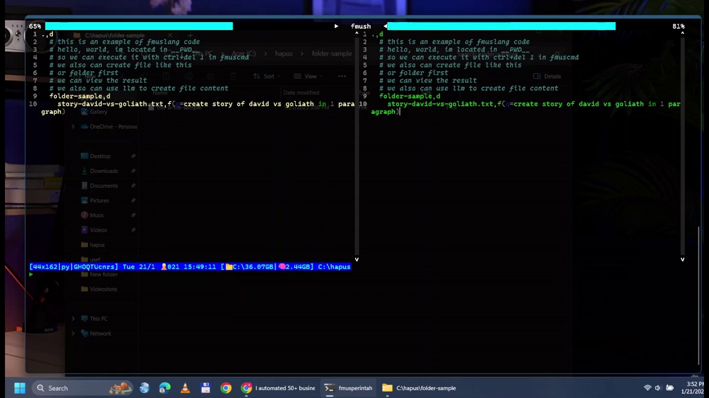

# fmuslang & fmuscmd (fmustools)

**fmuslang** is a declarative, tree-based programming language designed for automation and filesystem operations. It represents the filesystem in a hierarchical structure, allowing users to define and invoke operations on each node within the filesystem.

**fmuscmd** (fmustools) is a command-line interface (CLI) tool built on top of **fmuslang**, providing a user-friendly way to interact with the language's capabilities directly from the terminal.


The main grammar specification is within `fmustools\fmuslang\schnell\creator\grammar\grammar.py`.

There are also other languages such as **declang** which is part of the fmuslang family, with grammar `fmustools\fmuslang\schnell\creator\grammar\decl.py`.

### Hello world in Fmuslang

<figure>
  
  <figcaption style="font-style: italic;">Within fmuscmd, it's easy to run fmuslang code, just type the code on the top right editor, then press ctrl+del and 1.</figcaption>
</figure>

---

# Demo Video

Here's a quick "Hello, World" demo of fmuscmd in action:

[Watch the video on YouTube](https://www.youtube.com/watch?v=g3EUZskrNWo)


## Features

- **Declarative Syntax**: Define what actions should be performed rather than how to perform them.
- **Hierarchical Structure**: Represent the filesystem in a tree-like structure for intuitive navigation and operation.
- **Automation**: Automate complex workflows, manage files, and perform batch operations with ease.
- **Extensible CLI**: **fmuscmd** offers a suite of commands and utilities, with the ability to define custom commands and workflows.
- **Cross-Platform**: Designed to work across different operating systems, making it versatile for various environments.
- **Many others**: There are a lot of other features which I have not mentioned here due to lack of time.

## Getting Started

### Prerequisites

- Python 3.x
- pip (Python package manager)

### Installation

1. Clone the repository:
   ```sh
   git clone https://github.com/mexyusef/fmustools.git
   cd fmustools
   ```

2. Install the required dependencies:
   ```sh
   pip install -r requirements.txt
   ```

3. Run the CLI tool:
   ```sh
   python fmuscmd/main.py
   ```

## Usage

### Basic Commands

- Run fmuscmd: `python fmustools/fmuscmd/main.py`

### Example Workflow Script

Here is a sample fmus code

- `fmustools\fmuslang\schnell\app\quick\blitz\a\adminator\vendor.fmus`

- `fmustools\fmuslang\schnell\app\transpiler\frontend\fslang\dropwizard_mongo\index-input.fmus`

Some of them have `.mk`, `.fm`, or `.us` extension due to legacy reason.

## Contributing

We welcome contributions! Please read our [CONTRIBUTING.md](CONTRIBUTING.md) for details on how to get started.

## License

This project is licensed under the MIT License - see the [LICENSE](LICENSE) file for details.
